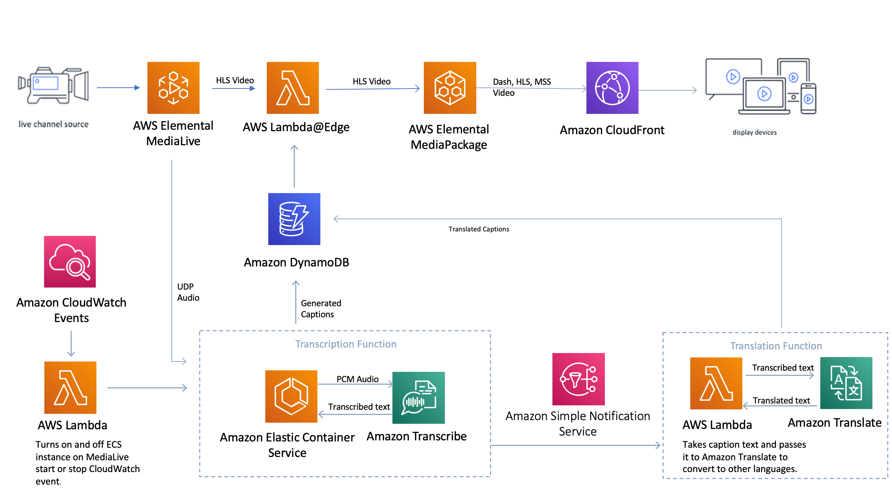
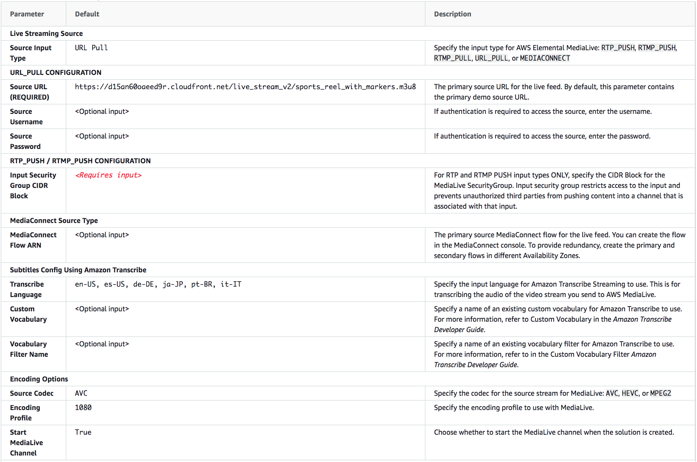

**Update: Checkout this new caption project using Amazon Interactive Video service (IVS)** <br/>
**https://github.com/aws-samples/amazon-ivs-auto-captions-web-demo** <br/>


# Live Streaming with Automated Multi-Language Subtitling

Live Streaming with Automated Multi-Language Subtitling is a GitHub sample that automatically generates multi-language subtitles for live events. 

This code sample uses Amazon Machine Learning (ML) services for transcription and translation. This sample provides subtitles not to be confused with captions that have environmental sounds used for broadcast television.

## On this Page
- [Live Streaming with Automated Multi-Language Subtitling](#live-streaming-with-automated-multi-language-subtitling)
  - [On this Page](#on-this-page)
  - [Architecture Overview](#architecture-overview)
  - [Launching the stack](#launching-the-stack)
  - [Deployment](#deployment)
  - [Considerations:](#considerations)
    - [Amazon Transcribe streaming limits](#amazon-transcribe-streaming-limits)
    - [Encoding profile](#encoding-profile)
    - [Amazon VPC limits](#amazon-vpc-limits)
    - [Changing input language](#changing-input-language)
    - [Changing translated languages](#changing-translated-languages)
    - [Regional deployment](#regional-deployment)
    - [Additional considerations](#additional-considerations)
    - [Troubleshooting](#troubleshooting)
  - [Creating a custom build](#creating-a-custom-build)
    - [Prerequisites:](#prerequisites)
    - [1. Clone the repo](#1-clone-the-repo)
    - [2. Go to the deployment directory](#2-go-to-the-deployment-directory)
    - [3. Create an Amazon S3 Bucket](#3-create-an-amazon-s3-bucket)
    - [4. Create the deployment packages](#4-create-the-deployment-packages)
    - [5. Launch the CloudFormation template.](#5-launch-the-cloudformation-template)
  - [License](#license)

## Architecture Overview


The included AWS CloudFormation template deploys the following AWS services:

- AWS MediaLive
- AWS MediaPackage
- Amazon CloudFront
- Amazon CloudWatch Events
- Amazon Simple Notification Service (Amazon SNS)
- Amazon Simple Storage Service (Amazon S3)
- Amazon Transcribe
- Amazon Elastic Container Service (Amazon ECS)
- Amazon Translate
- AWS Lambda
 
In order to get machine generated subtitles into AWS MediaPackage we use Amazon CloudFront as a proxy between AWS MediaLive and AWS Mediapackage. An HLS video stream with empty WebVtt files passes from AWS MediaLive to Amazon CloudFront with Lambda@Edge inserting subtitle text into just WebVTT files. After passing through Amazon CloudFront the video, audio, and manifest files are passed through to the AWS MediaPackage ingest url.

The Amazon CloudFront endpoint that is acting as a proxy passes through all video files, manifests, and only invokes a Lambda@Edge function with a regex when a WebVTT subtitile file is detected passing from AWS MediaLive to AWS MediaPackage. 

Additionally AWS MediaLive outputs an audio-only User Datagram Protocol (UDP) stream to an Amazon ECS container. This container transmits an audio stream to Amazon Transcribe Streaming, which receives the text contained in the stream as asynchronous responses and writes each text response to an Amazon Dynamo DB table. This Amazon ECS container also sends Amazon SNS notifications to an Amazon Translate Lambda function, which creates translated subtitles that are written to the same Amazon Dynamo DB table.

Each WebVTT file invokes the Lambda@Edge function, which inserts subtitles and then the WebVTT file passes onto MediaPackage. MediaLive provides the authentication headers.

AWS MediaPackage has three endpoint preconfigured Dash, HLS, and Microsoft Smooth.
 
An Amazon CloudFront distribution is configured to use the MediaPackage custom endpoints as its origin. This CloudFront URL is what is provided to the viewers of the live steam.


## Launching the stack
This automated AWS CloudFormation template deploys Live Streaming with Automated Multi-Language Subtitling on the AWS Cloud.

Note
You are responsible for the cost of the AWS services used while running this project. See the Cost section for more details. For full details, see the pricing webpage for each AWS service you will be using in this project.

1) Log in to the AWS Management Console and click the button below to launch the live-streaming-with-automated-multi-language-subtitling AWS CloudFormation template.

 <br> [](https://console.aws.amazon.com/cloudformation/home?region=us-east-1#/stacks/new?&amp;templateURL=https%3A%2F%2Frodeolabz-us-east-1.s3.us-east-1.amazonaws.com%2Flive-streaming-with-automated-multi-language-subtitling%2Fv2.0.0%2Flive-streaming-with-automated-multi-language-subtitling.yaml)
                  

You can also download the template as a starting point for your own implementation.

2) The template is launched in the US East (N. Virginia) Region by default. To launch this project in a different AWS Region, use the region selector in the console navigation bar.

Note
This project uses the Amazon Translate, Amazon Transcribe, AWS MediaLive, MediaPackage, and MediaConnect services, which are currently available in specific AWS Regions only. Therefore, you must launch this project in an AWS Region where these services are available. For the most current service availability by region, see the AWS service offerings by region.

3) On the Select Template page, verify that you selected the correct template and choose Next.

4) On the Specify Details page, assign a name to your stack.

5) Under Parameters, review the parameters for the template, and modify them as necessary.

The following default values are used. 



## Deployment
This is a link to the CloudFormation template to deploy this project. 


## Considerations:
### Profanity is showing up in my stream
The Amazon Transcribe Streaming service that is used in this sample has a feature to filter out words you do not want to see in your stream.
Simply make a text file with a list of all of the words you do not want to show up in your stream, and use the AWS Console to create a vocabulary filter in the AWS Transcribe console. Make sure you make this filter in the same region you are launching the CloudFormation in. 
Use the Profanity Filter Name field when launching your CloudFormation to name a vocabulary filter you created in the AWS Console. 

### Amazon Transcribe streaming limits
Amazon Transcribe Streaming is used within the Amazon ECS container. The Amazon Transcribe
Streaming quota is five concurrent streams and we recommend requesting a service limit increase for
the number of Amazon Transcribe Streams. For more information on limits, refer to Amazon Transcribe
Limits. To request a limits increase, use the Amazon Transcribe service limits increase form.

### Why do Subtitiles show up after someone says something? 
The average subtitile latency on this project is 6-10 seconds. This project does not delay video any to sync with the subtitiles. The subtitile latency getting generated through AWS Transcribe on average is 6-10 seconds. This project allows for a customer to have a low latency video stream, but the subtitiles will show up 10 seconds behind when someone says it, since this is the time it takes to generate text from audio on AWS Transcribe, build up a sentence in Dynamo DB, then for Lambda@Edge to insert this sentence into the WebVTT file that is being passed to AWS MediaPackage from the Lambda@Edge in AWS CloudFront. 

### Encoding profile
This project leverages the AWS Elemental MediaLive encoding profile from Live Streaming on AWS. The encoding profile is listed below.
• 1080p profile: 1080p@6000kbps, 720p@3000kbps, 480p@1500kbps, 240p@750kbps

### Amazon VPC limits
This project deploys a new Amazon Virtual Private Cloud (VPC) for the Amazon Transcribe ECS instance.
If you plan to deploy more than once instance of this project in one AWS Region, you may need to
increase the Amazon VPC quota for your target Region. The default Amazon VPC limit is five per Region.

### Changing input language
This project uses AWS Transcribe Streaming to transcribe the source language stored in AWS
MediaLive. The default source language for transcriptions is English (en-US). If your source content is
in a different language, change the TranslateLanguage input when launching your CloudFormation
template. In addition, you must edit the AWS MediaLive channel Output 5: english. Modify
the Name Modifier language code from _en to your selected language. For example, if your selected
language is Spanish (es-US), update the Name Modifier with _es when deploying the CloudFormation
stack. You can also change the language code and language description as well. 


### Changing translated languages
To change the output languages, you must 1. update the caption output and 2. update the Name Modifier. If you add additional caption outputs to the MediaLive channel, you must add the language code to the SNSTriggerAWSTranslateLambda function as well. To change the translated language:

1. Log in to the AWS MediaLive console.

2. Locate the appropriate channel and under **Channel Actions**, select **Edit Channel**. If the channel is already running, choose **Stop Channel** first.

3. Under **Output groups**, choose **Live (HLS)** and choose **Add output** to add additional translated output languages. Update the **Name Modifier** with the language code from the Supported language codes in the Amazon Translate Developer Guide. For example: The **Name Modifier** for Spanish is _es.

4. Choose **Update Channel**.

5. Navigate to the AWS Lambda console.

6. Locate the SNSTriggerAWSTranslateLambda Lambda function, and update the **CAPTION_LANGUAGES** variable using the appropriate language code from the Supported language codes in the Amazon Translate Developer Guide. Use a comma to separate multiple languages. For example: CAPTION_LANGUAGES:en,es,fr,de.


### Regional deployment
This project uses Amazon Translate, AWS MediaLive, AWS MediaPackage, Amazon
Transcribe Streaming, and AWS MediaConnect which are currently available in specific AWS
Regions only. Therefore, you must launch this project in an AWS Region where these services are
available. For the most current service availability by region, refer to AWS Service offerings by Region.

### Additional considerations

This project allows for a single input language and up to five translated caption languages. Similar to a stenographer, the subtitles are slightly time-delayed from the audio. This project is optimized for two second HTTP Live Streaming (HLS) segments on AWS MediaLive, results are unknown with different segment sizes and may have a poor user experience. This implementation may not be suitable as a replacement for a human stenographer, especially for broadcast applications where users are familiar with human generated subtitles.


### Troubleshooting

If you are not getting subtitles when watching your live stream, follow these troubleshooting instructions:

1. Log in to the AWS Management console.

2. Navigate to the Amazon ECS console and locate the ECS container that contains the Stack Name you used to create your ECS service.
   
3. On the Tasks tab in the ECS service, choose the task name.
   
4. Choose the log tab. The logs listed can show exceptions, such as LimitExceeded. In this case you have to increase your Amazon Transcribe Streaming limit on your AWS account for the region you are running in.

If you are still not seeing subtitles, restart the ECS task by choosing stop. When you stop an ECS task a new task should start in a few minutes.

## Creating a custom build

### Prerequisites:
* [AWS Command Line Interface](https://aws.amazon.com/cli/)
* Python 3.x or later

Follow these steps to generate a CloudFormation template and deploy custom resources to an S3 bucket for launch. To launch the project the Lambda source code has to be deployed to an Amazon S3 bucket in the region you intend to deploy the project. 

### 1. Clone the repo
Download or clone the repo and make the required changes to the source code.

### 2. Go to the deployment directory
Go to the deployment directory:
```
cd ./deployment
```

### 3. Create an Amazon S3 Bucket
The CloudFormation template is configured to pull the Lambda deployment packages from Amazon S3 bucket in the region the template is being launched in. Create a bucket in the desired region with the region name appended to the name of the bucket. eg: for us-east-1 create a bucket named: `my-bucket-us-east-1`
```
aws s3 mb s3://my-bucket-us-east-1
```

### 4. Create the deployment packages
Build the distributable:
```
chmod +x ./build-s3-dist.sh
./build-s3-dist.sh <bucketnsme> live-streaming-with-automated-multi-language-subtitling <version>
```

> **Notes**: The _build-s3-dist_ script expects the bucket name as one of its parameters, and this value should not include the region suffix

Deploy the distributable to the Amazon S3 bucket in your account:
```
aws s3 sync ./regional-s3-assets/ s3://my-bucket-us-east-1/live-streaming-with-automated-multi-language-subtitling/<version>/
aws s3 sync ./global-s3-assets/ s3://my-bucket-us-east-1/live-streaming-with-automated-multi-language-subtitling/<version>/
```

### 5. Launch the CloudFormation template.
* Get the link of the live-streaming-with-automated-multi-language-subtitling.template uploaded to your Amazon S3 bucket.
* Deploy the project in the Amazon CloudFormation console within the same account you created the S3 buckets in.

## License

* This project is licensed under the terms of the Apache 2.0 license. See `LICENSE`.
