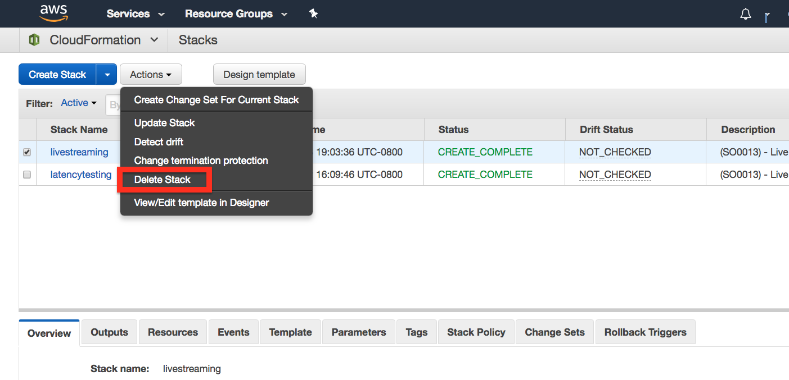

# Uninstall  

## Delete CloudFormation Stack
This deploys the solution without using CloudFormation. If you are using this in a production environment use the Launch Stack button on the main page. This launch stack will take 5 minutes or less. 

### Deleting the CloudFormation Stack will stop and delete the live steam

## S3 Buckets
CloudFormation does not delete the two S3 buckets that are created when the stack is run. These two buckets will have to be deleted manually. 

Navigate to [README](README.md) | [Workshop](WORKSHOP.md) | [Uninstall](UNINSTALL.md)
