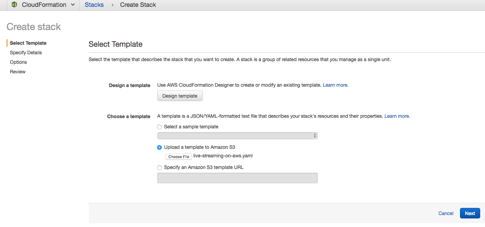
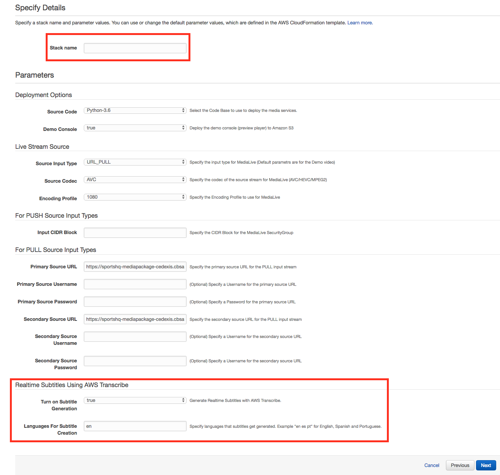
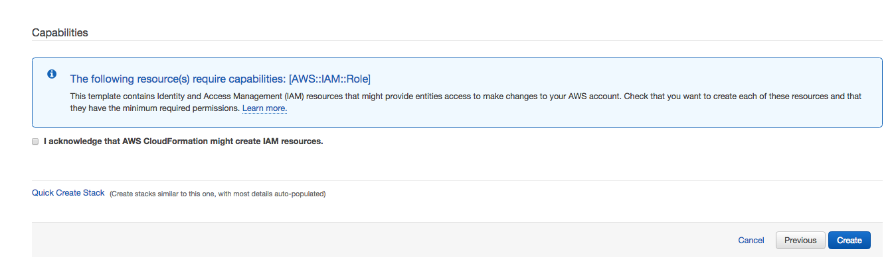
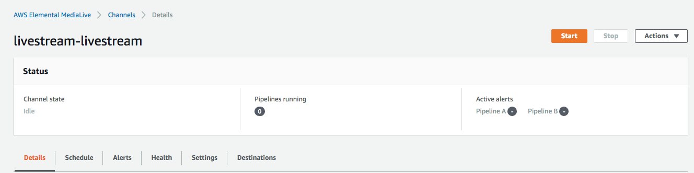
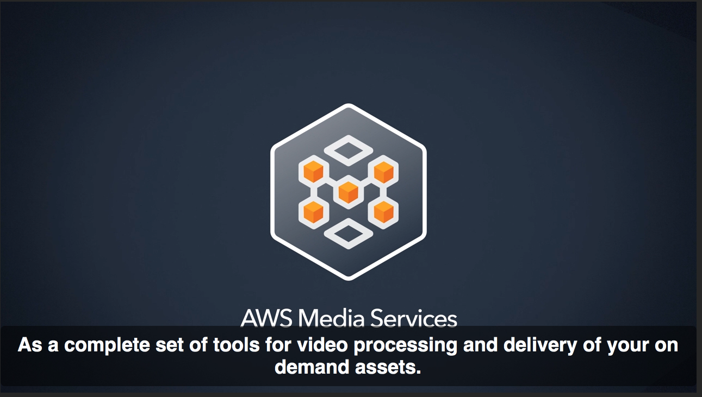

# Workshop
Utilizes AWS Transcribe Streaming to create live captions for live video streaming. This solution uses AWS MediaLive as the encoder, AWS MediaPackage, Amazon Translate, Amazon Transcribe Streaming, Amazon S3, Amazon Lambda, and API Gateway. 

### This QuickStart guide does not use CloudFormation in the deployment

## QuickStart Deployment
This deploys the solution without using CloudFormation. If you are using this in a production environment use the Launch Stack button on the main page. This launch stack will take 5 minutes or less. 

#### Deploy in US-West-2    

Follow these steps to deploy your stack.

### Step 1: Start The CloudFormation

### Step 2: Setup The Stack

Choose any name for the stack. Then add a Primary and Secondary source URL.

Lastly make sure to choose the languages that you want AWS Transcribe Streaming to generate for the live stream.

Provide comma delimited language codes for the caption languages you want generated for your Live Stream.  
For example.

    en, es, pt
   
Here is list of the supported languages.

	LANGUAGE_CODES = {
	    'ar': 'Arabic',
	    'zh': 'Chinese Simplified',
	    'zh-TW': 'Chinese Traditional',
	    'cs': 'Czech',
	    'da': 'Danish',
	    'nl': 'Dutch',
	    'en': 'English',
	    'fi': 'Finnish',
	    'fr': 'French',
	    'de': 'German',
	    'he': 'Hebrew',
	    'id': 'Indonesian',
	    'it': 'Italian',
	    'ja': 'Japanese',
	    'ko': 'Korean',
	    'pl': 'Polish',
	    'pt': 'Portuguese',
	    'ru': 'Russian',
	    'es': 'Spanish',
	    'sv': 'Swedish',
	    'tr': 'Turkish'
	}

### Step 3: Finish Starting the CloudFormation

Click the I accept button then click "Create" to start the stack.

### Step 4: Start AWS MediaLive Channel

For cost purposes the CloudFormation does not start the MediaLive Channel. 
Head over to the MediaLive console page and click the Start Button to start your channel.

The MediaLive Channel has to be started before you can start seeing a video stream. 

### Step 5: Watch The LiveStream

Under the outputs of the CloudFormation template get the MediaPackage endpoint to view the channel.

<b> After starting the MediaLive Channel and it has been playing for a minute check out your live stream here. Paste the URL ending in m3u8 from the outputs in CloudFormation into this demo player page. </b>

[HLS JS Demo Player](https://video-dev.github.io/hls.js/stable/demo/)

When you are done with the live event, stop the MediaLive channel. If you want zero cost after a live event delete the CloudFormation stack that you created in the CloudFormation console. The only items that should be left are a logs S3 Bucket and a captions S3 Bucket. You can delete these two items manually. Even if these buckets are left after a live stream thier cost is low. 

## Preview
Here is the solution using a free live broadcast as the input feed.

## Additional Resources

***

Copyright 2018 Amazon.com, Inc. or its affiliates. All Rights Reserved.

Licensed under the Amazon Software License (the "License"). You may not use this file except in compliance with the License. A copy of the License is located at

    http://aws.amazon.com/asl/

or in the "license" file accompanying this file. This file is distributed on an "AS IS" BASIS, WITHOUT WARRANTIES OR CONDITIONS OF ANY KIND, express or implied. See the License for the specific language governing permissions and limitations under the License.