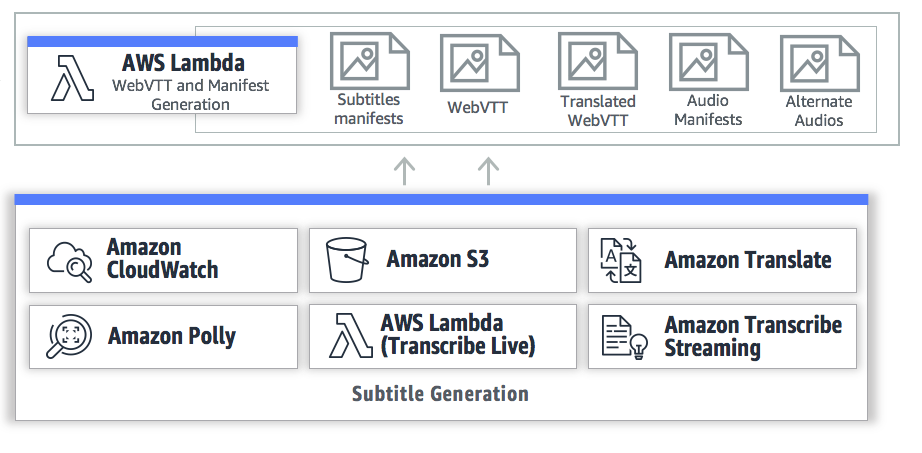

# AWS Lambda Function: Caption Creation 

This is the AWS Lambda function that is generating the vtt manifests, vtt files, and using WebDav to send these files into MediaPackage. All of the main functions of this solution happen in this AWS Lambda. This AWS Lambda function triggers when a new file is written to S3. This is through AWS CloudWatch events. 

## On this Page

- [Architecture Diagram](#architecture-overview)
- [Requirements](#Requierments)
- [Manual Deployment](#deployment)

## Architecture Diagram 

## Requirements

In order to get the Python package requierments run the following commands in the directory of this AWS Lambda function.

	virtualenv -p python3.6 venv
	
	source venv/bin/activate
	
	pip install -r requierments.txt
	
	
Next get ffmpeg and ffprobe binary files that are compiled to run on Amazon Linux and put them into the root of this directory. 

FFMPEG : [ffmpeg](https://rodeolabz-us-west-2.s3.amazonaws.com/live-streaming-on-aws/ffmpeg)

FFPROBE : [ffprobe](https://rodeolabz-us-west-2.s3.amazonaws.com/live-streaming-on-aws/ffprobe)

Your directory stucture should look like this. 

	ls
	
	venv/
	lambda_function.py
	deploy.sh
	ffmpeg
	ffprobe
	
	
Make sure the files are in this stucture. Modify the deploy.sh script to include your Python 3.6 Lambda ARN. When you run the deploy.sh script a deploy.zip file is created in this directory and uplaoded to AWS Lambda. 

	bash deploy.sh 
	

The deploy.zip Python 3.6 AWS Lambda function will appear in your directory.

	ls
	
	venv/
	lambda_function.py
	deploy.sh
	deploy.zip
	deploy/
	ffmpeg
	ffprobe
	

	
## Manual Deployment

After you complete the requirements section above you will get a deploy.zip file. This is deployed with the deploy.sh script, or you can manually upload this via the AWS console within AWS Lambda. 

If you are manually creating this Caption Creation AWS Lambda it has environment variables and uses the Python 3.6 runtime. This AWS Lambda needs versioning turned on for the S3 bucket. Other details like the role can be found within the CloudFormation template.

